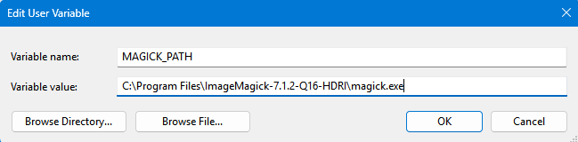
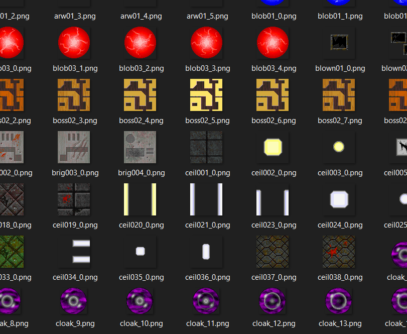

# GIF Converter w/Transparency option - Code

1. Make transparent ```node transparency-maker.js```
2. Create GIFs ```node gifcreator.js```
3. Create transparent GIFs ```node transparent-gif-creator.js```

IMPORTANT NOTE:
- This extension only works if you have the ImageMagick tool installed on your windows PC. with an $env pathed to your Windows system variables. Find your magick.exe, and create a new system variable in `/Program Files/` so the tool can find it.


Output Folders:
- converted/gifs/ - Regular animated GIFs
- converted/transparent/ - Transparent PNG textures
- converted/transparent-gifs/ - Transparent animated GIFs

**For transparency, tool is made with generative LLM technology**

# Descent-Extractor - Daivuk
Node JS tool to extract assets from Descent game and convert them 

1. Copy **descent.pig** and **descent.hog** files from your Descent installation into the `input/` directory.
2. Install the NPM modules:
   ```
   npm install
   ```
3. Extract assets
   ```
   node extractor.js
   ```

Extracted assets in their Raw data will be inside `output/` directory.

The converted assets into PNGs will be inside `converted/` directory.

Only thing missing are Models.
